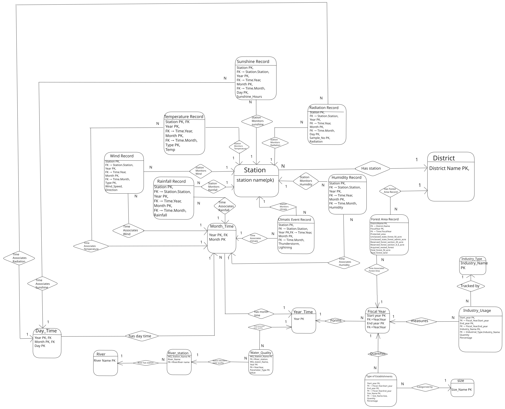

# Bangladesh Environmental Data Integration Model

A relational database project for collecting, organizing, and integrating environmental data about Bangladesh.

This project was developed as part of the Database Systems Lab course at the Department of Computer Science and Engineering, University of Chittagong. Our goal was to take environmental data from different sources, process it, and turn it into a single structured and normalized relational database.

---

## 1. Problem Statement

Environmental information about Bangladesh is available from many different organizations, but it is often scattered across reports, spreadsheets, PDFs, and other formats. Different sources also organize their data differently, use different time periods, and follow different structures.

This makes it difficult to work with the information as one dataset.

The goal of this project was to collect a selected set of environmental data, clean and structure it, identify the relationships between different types of information, and integrate everything into a single relational database.

---

## 2. Project Overview

The project follows the data from its original source to the final database.

We started by finding and reviewing environmental datasets from different organizations. The selected data was then extracted and converted into structured formats. After cleaning and reviewing the data, we designed ER models for the different datasets and combined them into an integrated model.

The resulting relations were then normalized from 0NF through 1NF, 2NF, 3NF, and finally BCNF before being implemented as the final database.

The final database contains:

| Metric | Value |
|---|---:|
| Relations | 21 |
| Columns | 75 |
| Records | 730,337 |
| Foreign-key definitions | 27 |
| Integrity violations | 0 |

The database covers several areas of environmental information, including climate, rainfall, humidity, wind, sunshine, radiation, water quality, rivers, forest area, and industrial data.

---

## 3. Project Objectives

The main objectives of the project were to:

- Collect relevant environmental data from reliable sources.
- Convert data from different source formats into structured datasets.
- Clean and standardize the collected data while preserving its original meaning.
- Identify entities, attributes, keys, and relationships across the datasets.
- Design and integrate the individual ER models.
- Normalize the resulting relations up to Boyce-Codd Normal Form (BCNF).
- Implement the final relational schema and load the processed data.
- Verify the database structure and relationships using SQL and integrity checks.

---

## 4. Project Structure

The repository is organized around the major stages of the project.

```text
DBMS_Project/
│
├── ERD/
│   └── Final_ERD.png
│
├── normalization/
│   ├── csv/
│   ├── exclusions/
│   ├── review/
│   ├── scripts/
│   └── Environmental_Normalization_0NF_to_BCNF.xlsx
│
├── schema/
│   ├── sql/
│   ├── scripts/
│   └── environment.db
│
├── MySQL/
│   └── MySQL/MariaDB version
│
├── report/
│   └── Project report
│
├── requirements.txt
├── setup_linux.sh
├── setup_windows.bat
└── README.md
````

### Main directories

* **`ERD/`** contains the final Entity-Relationship Diagram.
* **`normalization/`** contains the normalization workbook, processed CSV files, review material, exclusions, and related scripts.
* **`schema/`** contains the SQLite database, SQL schema, saved queries, and database scripts.
* **`MySQL/`** contains the MySQL/MariaDB version of the database.
* **`report/`** contains the detailed project report.

---

## 5. Data Collection & Data Pipeline

Data collection was one of the first major stages of the project.

We reviewed environmental information from different organizations and selected sources that were relevant and usable for the final database. The main sources used in the implemented database include:

* Bangladesh Bureau of Statistics (BBS)
* Bangladesh Meteorological Department (BMD)
* Bangladesh Rice Research Institute (BRRI)
* Bangladesh Water Development Board (BWDB)

Other sources were also considered during the source discovery process, including international organizations and public data platforms.

After selecting the sources, the data was extracted from its original formats and converted into structured data. The collected material produced 68 structured data blocks that were then taken through the cleaning, modelling, and normalization process.

### Data Pipeline

```text
              Data Sources
                   │
                   ▼
        Source Review & Selection
                   │
                   ▼
             Data Extraction
                   │
                   ▼
          Structured 0NF Data
                   │
                   ▼
        Cleaning & Transformation
                   │
                   ▼
          Dataset ER Modelling
                   │
                   ▼
        Integrated ER Model
                   │
                   ▼
         1NF → 2NF → 3NF → BCNF
                   │
                   ▼
        Final Relational Schema
                   │
                   ▼
          Database Construction
                   │
                   ▼
        Verification & SQL Queries
```

The source data was not always ready to be inserted directly into a database. Some spreadsheets were designed for human reading, with months or days represented as separate columns. Other datasets contained differences in naming, structure, time periods, or missing values.

During the transformation stage, these structures were reshaped so that each record represented a meaningful observation. For example, monthly measurements were converted into rows containing the station, year, month, and corresponding value instead of keeping each month as a separate column.

The data was then reviewed and prepared for the database design stage.

---

## 6. Normalization

After the data was structured, we needed to design relations that avoided unnecessary repetition and dependency problems.

The normalization process followed:

```text
0NF → 1NF → 2NF → 3NF → BCNF
```

At each stage, the structure of the data was examined for repeated values, partial dependencies, transitive dependencies, and unsuitable determinants.

### Example: Temperature Records

A temperature observation is identified by:

```text
Station Name + Year + Month + Temperature Type
```

This combination became the composite primary key of the `Temperature_Record` relation.

Instead of storing station information repeatedly inside every temperature record, station information is kept separately in the `Station` relation.

```text
Station
---------
Station_Name
District_Name

        │
        │ 1
        │
        │
        │ N
        ▼

Temperature_Record
------------------
Station_Name
Year
Month
Type
Temp
```

The same idea was applied to the other environmental measurements. Information describing a station, district, time period, river, category, or industry was separated from the actual observations that depend on it.

The final relations were then checked under BCNF to ensure that every determinant in the retained relations was a candidate key.

---

## 7. Entity-Relationship Diagram

The final ERD represents the integrated database model produced after the data collection, modelling, and normalization stages.



The model separates different types of environmental information into focused relations while connecting them through shared entities such as stations, rivers, districts, and time.

The database uses different time relations for yearly, monthly, daily, and fiscal-year data because the original datasets do not all use the same observation period.

---

## 8. Final Schema

The final database contains 21 relations. Each relation has a defined primary key, with composite keys being used where multiple attributes are needed to uniquely identify an observation.

### Reference and Time Relations

| Relation        | Primary Key            |
| --------------- | ---------------------- |
| `Station`       | `Station_Name`         |
| `District`      | `District_Name`        |
| `River`         | `River_Name`           |
| `River_Station` | `WQ_Station_Name`      |
| `Year_Time`     | `Year`                 |
| `Month_Time`    | `Year, Month`          |
| `Day_Time`      | `Year, Month, Day`     |
| `Fiscal_Year`   | `Start_Year, End_Year` |
| `Size`          | `Size_Name`            |
| `Industry_Type` | `Industry_Name`        |

### Environmental and Observation Relations

| Relation                 | Primary Key                                         |
| ------------------------ | --------------------------------------------------- |
| `Temperature_Record`     | `Station_Name, Year, Month, Type`                   |
| `Humidity_Record`        | `Station_Name, Year, Month`                         |
| `Rainfall_Record`        | `Station_Name, Year, Month`                         |
| `Wind_Record`            | `Station_Name, Year, Month, Type`                   |
| `Climatic_Event_Record`  | `Station_Name, Year, Month`                         |
| `Sunshine_Record`        | `Station_Name, Year, Month, Day`                    |
| `Radiation_Record`       | `Station_Name, Year, Month, Day, Sample_No`         |
| `Water_Quality`          | `WQ_Station_Name, Year, Parameter_Type`             |
| `Forest_Area_Record`     | `District_Name, Fiscal_Start_Year, Fiscal_End_Year` |
| `Type_Of_Establishments` | `Size_Name, Start_Year, End_Year`                   |
| `Industry_Usage`         | `Industry_Name, Start_Year, End_Year`               |

The final design keeps reference information separate from observations while still allowing the different parts of the database to be connected through foreign keys.

---

## 9. Database Implementation

The main implementation of the final database is **SQLite**.

SQLite was used because it provided a lightweight and portable relational database that could be built directly from the processed CSV files using our Python scripts.

The database is created from the committed SQL schema and populated through the project scripts rather than being manually filled. Foreign-key enforcement and database integrity checks are also enabled during the build and verification process.

A MySQL/MariaDB version of the database is also included in the repository.

---

## 10. Example Queries

The database can be queried to retrieve information across the different environmental datasets.

### Find rainfall records for a station

```sql
SELECT Station_Name, Year, Month, Rainfall
FROM Rainfall_Record
WHERE Station_Name = 'Dhaka'
  AND Year BETWEEN 2020 AND 2022;
```

### Find temperature records

```sql
SELECT Station_Name, Year, Month, Type, Temp
FROM Temperature_Record
WHERE Year = 2020
ORDER BY Station_Name, Month;
```

### Join water-quality data with river information

```sql
SELECT
    w.WQ_Station_Name,
    r.River_Name,
    w.Year,
    w.Parameter_Type,
    w.Value
FROM Water_Quality AS w
JOIN River_Station AS rs
    ON w.WQ_Station_Name = rs.WQ_Station_Name
JOIN River AS r
    ON rs.River_Name = r.River_Name;
```

### Count records by rainfall year

```sql
SELECT
    Year,
    COUNT(*) AS Record_Count
FROM Rainfall_Record
GROUP BY Year
ORDER BY Year;
```

These queries demonstrate how the normalized relations can be used individually and together to retrieve environmental information.

---

## 11. Conclusion

This project took environmental information that was scattered across different sources and gradually turned it into one structured relational database.

The database design was only one part of the work. We first had to find suitable sources, understand how their data was organized, clean and reshape the records, identify entities and relationships, and then apply normalization to reach the final BCNF design.

The result is a database containing 21 relations and more than 730,000 records, with the relationships and integrity constraints needed to keep the data connected and consistent.

More importantly, the project gave us practical experience applying database concepts such as ER modelling, functional dependencies, normalization, primary keys, foreign keys, relational integrity, and SQL to real-world data.

```

This version is intentionally **leaner than the previous one**. I also removed some things that were starting to make it feel like a second report.

One small recommendation before you commit it: **replace the ASCII data-pipeline diagram with a proper image**. Keep the repository structure as code because that is actually easier to read, but a clean pipeline graphic will make the README feel much more polished.
```
